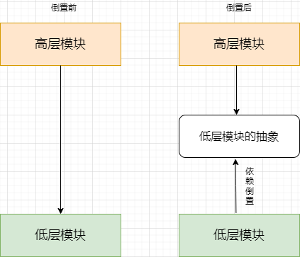

# 设计模式

## 六大原则

### 单一职责

### 开闭原则

开闭原则(Open-Closed Principle, OCP)：一个软件实体应当对扩展开放，对修改关闭。即软件实体应尽量在不修改原有代码的情况下进行扩展。

### 里氏替换原则

里氏代换原则(Liskov Substitution Principle, LSP)：所有引用基类（父类）的地方必须能透明地使用其子类的对象。

### 依赖倒置原则

依赖倒转原则(Dependency Inversion Principle, DIP)：抽象不应该依赖于细节，细节应当依赖于抽象。换言之，要针对接口编程，而不是针对实现编程。

关键点：

- 高层模块不应该依赖低层模块，两者都应该依赖其抽象
- 抽象不应该依赖细节
- 细节应该依赖抽象

正常情况下：调用类（高层模块）应该依赖具体实现类（低层模块实现细节）倒置后：高层模块与低层模块都依赖了实现类的接口（低层模块的细节抽象），底层模块的依赖箭头向上了，所以叫依赖倒置了。

### 接口隔离原则

接口隔离原则(Interface Segregation Principle, ISP)：使用多个专门的接口，而不使用单一的总接口，即客户端不应该依赖那些它不需要的接口。

### 迪米特原则

迪米特法则(Law of Demeter, LoD)：一个软件实体应当尽可能少地与其他实体发生相互作用。

## 创建型（creational）（5）

#### _简单工厂_（非 不符合开闭原则）

简单工厂模式（Simple Factory Pattern）是工厂模式的一种，它通过一个工厂类来封装对象的创建过程，根据传入的参数或条件来创建具体的对象实例。

简单工厂模式具有以下特点：

- 有一个具体的工厂类，负责创建具体的对象实例。
- 工厂类通常包含一个静态方法或实例方法，根据传入的参数或条件来创建对象。
- 客户端通过调用工厂类的方法来创建对象，而不需要直接实例化具体的对象。

### 工厂方法模式（Factory Method）

工厂模式（Factory Pattern）是一种创建型设计模式，它提供了一种统一的接口来创建对象，但将具体创建对象的逻辑延迟到子类中。工厂模式通过解耦对象的创建和使用，提供了一种灵活的方式来创建对象。

工厂模式由以下几个关键角色组成：

- 抽象工厂（Abstract Factory）：定义了创建对象的接口，可以是一个接口或抽象类。工厂类通常包含一个工厂方法，用于创建具体的产品对象。
- 具体工厂（Concrete Factory）：实现了抽象工厂的接口，负责具体的对象创建。
- 抽象产品（Abstract Product）：定义了产品对象的接口，可以是一个接口或抽象类。
- 具体产品（Concrete Product）：实现了抽象产品的接口，表示具体的产品对象。

工厂模式可以分为简单工厂模式、工厂方法模式和抽象工厂模式。简单工厂模式由一个工厂类负责创建所有的具体产品对象。工厂方法模式将具体产品的创建延迟到子类中，每个具体产品都对应一个具体工厂。抽象工厂模式提供了一种将一组相关产品对象的创建集中到一起的方式，每个具体工厂负责创建一族产品。

### 抽象工厂模式（Abstract Factory）

抽象工厂模式（Abstract Factory Pattern）是一种创建型设计模式，它提供了一种方式来创建一组相关或相互依赖的对象，而无需指定它们具体的类。抽象工厂模式通过将对象的创建委托给多个具体工厂类，实现了对象创建和使用的解耦。

抽象工厂模式由以下几个关键角色组成：

- 抽象工厂（Abstract Factory）：定义了创建一组相关产品对象的接口，可以是一个接口或抽象类。抽象工厂通常包含多个工厂方法，每个工厂方法用于创建一个具体产品对象。
- 具体工厂（Concrete Factory）：实现了抽象工厂的接口，负责创建具体的产品对象。
- 抽象产品（Abstract Product）：定义了产品对象的接口，可以是一个接口或抽象类。
- 具体产品（Concrete Product）：实现了抽象产品的接口，表示具体的产品对象。

### 构建者模式（Builder）

建造者模式（Builder Pattern）是一种创建型设计模式，它将复杂对象的构建过程与其表示分离，使得同样的构建过程可以创建不同的表示。

建造者模式的关键点是：

- 定义一个抽象的建造者（Builder）接口，该接口声明了构建产品各个部分的方法。
- 定义一个具体的建造者（Concrete Builder）类，实现了抽象建造者接口，负责具体产品各个部分的构建。
- 定义一个指导者（Director）类，负责使用建造者对象来构建最终的产品。
- 定义一个产品（Product）类，表示最终构建的复杂对象。

### 单例模式（Singleton）

单例模式（Singleton Pattern）是一种创建型设计模式，它保证一个类只有一个实例，并提供一个全局访问点来访问这个实例。

单例模式的关键点是：

- 私有化类的构造函数，使其不能被直接实例化。
- 提供一个静态方法或属性来获取类的唯一实例。
- 延迟实例化，即在第一次访问时才创建实例。
- 提供全局访问点，使其他代码可以方便地访问该实例。

### 原型模式（Prototype）

原型模式（Prototype Pattern）是一种创建型设计模式，它通过复制（克隆）现有对象来创建新的对象，而不是通过使用构造函数来创建。

原型模式的关键点是：

- 定义一个抽象原型类或接口，该原型类或接口声明了一个克隆方法（Clone）。
- 在具体原型类中实现克隆方法，该方法会返回一个新的对象，该对象是当前对象的副本。
- 在客户端代码中，通过调用原型对象的克隆方法来创建新的对象，而不是使用构造函数。

原型模式的主要思想是通过复制已有对象的属性和状态来创建新的对象，从而避免了使用构造函数进行对象的创建和初始化。这种方式也可以减少对象的创建成本，特别是当对象的创建过程较为复杂或耗时时。

## 结构型（structural）（7）

### 适配器模式（Adapter）

适配器模式（Adapter Pattern）是一种结构型设计模式，用于将一个类的接口转换成客户端所期望的另一个接口。适配器模式使得原本由于接口不兼容而不能一起工作的类可以协同工作。

适配器模式的关键点是：

- 目标接口（Target Interface）：客户端所期望的接口，适配器将原接口转换成目标接口。
- 适配者类（Adaptee Class）：需要被适配的类，它包含了客户端所需要的功能，但其接口与目标接口不兼容。
- 适配器类（Adapter Class）：实现了目标接口，同时持有一个适配者类的实例，在目标接口的方法中调用适配者类的相应方法来完成操作。

### 桥接模式（Bridge）

桥接模式（Bridge Pattern）是一种结构型设计模式，将抽象部分与其具体实现部分分离，使它们可以独立地变化。

桥接模式的关键点是：

- 抽象部分（Abstraction）：定义了抽象部分的接口，并维护一个指向实现部分的引用。
- 具体抽象类（Concrete Abstraction）：扩展抽象部分的接口，通常包含一些与实现部分相关的业务方法。一般会提供修改实现引用的功能
- 实现部分（Implementor）：定义实现部分的接口，提供基本操作的方法。
- 具体实现类（Concrete Implementor）：实现实现部分的接口，提供具体的实现。

桥接模式的目的是将抽象部分与其具体实现部分解耦，使它们可以独立地变化。通过桥接模式，可以在不修改现有抽象部分和实现部分的情况下，动态地组合不同的抽象部分和实现部分，从而实现更灵活的系统。

### 组合模式（Composite）

组合模式（Composite Pattern）是一种结构型设计模式，用于将对象组合成树形结构以表示"部分-整体"的层次结构。组合模式使得用户可以以一致的方式处理单个对象和组合对象。

组合模式的关键点是：

- 组件（Component）：定义了组合对象和叶子对象的共同接口，可以是抽象类或接口，提供了默认的行为和管理子组件的方法。
- 叶子（Leaf）：表示组合中的叶子对象，没有子组件。
- 组合（Composite）：表示组合中的组合对象，可以包含子组件，并实现了组件接口的方法。
- 客户端（Client）：通过组件接口与组合对象进行交互，可以递归地遍历整个组合结构。

组合模式的目的是通过统一的方式处理单个对象和组合对象，使得客户端代码更加简洁和通用。通过组合模式，可以将复杂的对象结构组织成树形结构，并对整个结构进行统一的处理，例如遍历、搜索等操作。

### 装饰者模式（Decorator）

装饰者模式（Decorator Pattern）是一种结构型设计模式，它允许你通过将对象包装在装饰器对象中来动态地为原始对象添加新的行为。装饰者模式提供了一种比继承更灵活的方式来扩展对象的功能。

装饰者模式的关键点是：

- 组件（Component）：定义了一个对象接口，可以给这些对象动态地添加职责。
- 具体组件（Concrete Component）：实现了组件接口的具体对象，即被装饰的原始对象。
- 装饰器（Decorator）：持有一个组件对象的引用，并实现了组件接口，可以在调用组件对象的方法前后添加额外的行为。
- 具体装饰器（Concrete Decorator）：具体的装饰器类，通过扩展装饰器类来添加新的行为。

### 外观模式（Facade）

外观模式（Facade Pattern）是一种结构型设计模式，它提供了一个统一的接口，用于访问系统中的一组接口。外观模式隐藏了系统的复杂性，并将客户端与系统的内部子系统解耦。

外观模式的关键点是：

- 外观（Facade）：提供了一个简化的接口，用于访问系统中的一组接口。外观模式将客户端与系统的内部子系统解耦，使得客户端只需要与外观对象进行交互。
- 子系统（Subsystems）：组成系统的各个类或模块，具有各自的接口和实现。外观对象将客户端的请求委派给子系统进行处理。

外观模式的目的是简化客户端与系统之间的交互，通过提供一个统一的接口，隐藏系统的复杂性。客户端只需要与外观对象进行交互，而无需直接与系统的各个子系统进行交互。

### 享元模式（Flyweight）

享元模式（Flyweight Pattern）是一种结构型设计模式，它通过共享对象来最大程度地减少内存使用和提高性能。享元模式将对象分为可共享的内部状态和不可共享的外部状态，通过共享内部状态来减少对象的数量。

享元模式的关键点是：

- 享元（Flyweight）：定义了共享对象的接口，包含了设置和获取外部状态的方法。
- 具体享元（Concrete Flyweight）：实现了享元接口，包含了内部状态和外部状态的具体实现。
- 享元工厂（Flyweight Factory）：负责创建和管理享元对象，提供了获取享元对象的方法。

享元模式通过共享内部状态来减少对象的数量，减少了内存的消耗和创建对象的开销。外部状态可以通过参数传递给享元对象，从而使得享元对象可以在不同的上下文中被共享。

### 代理模式（Proxy）

代理模式（Proxy Pattern）是一种结构型设计模式，它允许通过代理对象控制对真实对象的访问。代理模式在不改变原始对象的情况下，提供了一种间接访问对象的方式。

代理模式的关键点是：

- 抽象主题（Subject）：定义了真实主题和代理主题的共同接口，客户端通过这个接口访问真实主题。
- 真实主题（Real Subject）：定义了真正的对象，代理对象所代表的真实对象。
- 代理（Proxy）：持有一个对真实主题的引用，并提供了与真实主题相同的接口，可以在调用真实主题的方法前后添加额外的逻辑。

代理模式可以用于以下情况：

- 远程代理（Remote Proxy）：用于访问位于远程服务器上的对象。
- 虚拟代理（Virtual Proxy）：用于延迟加载对象的创建，直到真正需要使用时才去创建。
- 保护代理（Protection Proxy）：用于控制对对象的访问权限。
- 缓存代理（Caching Proxy）：用于提供对象的缓存，减少对真实对象的访问次数。

## 行为型（behavioral）（11）

### 责任链模式（Chain of responsibility）

责任链模式（Chain of Responsibility Pattern）是一种行为型设计模式，它允许多个对象按照顺序处理请求，直到找到能够处理请求的对象为止。责任链模式将请求发送者和接收者解耦，使得多个对象都有机会处理请求。

责任链模式的关键点是：

- 抽象处理者（Handler）：定义了处理请求的接口，并持有下一个处理者的引用。
- 具体处理者（Concrete Handler）：实现了抽象处理者的接口，负责处理请求。如果自己无法处理请求，可以将请求传递给下一个处理者。

责任链模式的核心思想是，将请求沿着处理者链进行传递，每个处理者判断自己是否能够处理请求，如果可以则进行处理，否则将请求传递给下一个处理者。

### 命令模式（Command）

命令模式（Command Pattern）是一种行为型设计模式，它将请求封装成一个对象，从而使得可以使用不同的请求参数、队列或日志来参数化其他对象。命令模式还支持撤销操作。

命令模式的关键点是：

- 命令（Command）：定义了执行操作的接口。
- 具体命令（Concrete Command）：实现了命令接口，负责执行具体的操作。
- 接收者（Receiver）：执行命令所要求的操作。
- 调用者（Invoker）：发送命令并要求执行操作。
- 客户端（Client）：创建具体命令对象并设置接收者。

命令模式的核心思想是将请求封装成一个对象，从而使得可以将请求参数化、队列化或者记录日志，以及支持撤销操作。

### 解释器模式（Interpreter）

解释器模式（Interpreter Pattern）是一种行为型设计模式，用于定义一种语言的文法，并解析和执行该语言中的表达式。

解释器模式的核心思想是将一个语言表达式表示为一个抽象语法树（Abstract Syntax Tree, AST），然后定义一组解释器来解析和执行这个语法树。

解释器模式的关键点是：

- 抽象表达式（Abstract Expression）：定义了一个抽象的解释操作方法。
- 终结符表达式（Terminal Expression）：实现了抽象表达式接口，并表示一个终结符表达式。
- 非终结符表达式（Non-terminal Expression）：实现了抽象表达式接口，并表示一个非终结符表达式，通常由多个终结符表达式组成。
- 上下文（Context）：包含解释器之外的一些全局信息。

### 迭代器模式（Iterator）

迭代器模式（Iterator Pattern）是一种行为型设计模式，用于提供一种统一的方式来遍历集合对象中的元素，而无需暴露集合的内部表示。

迭代器模式的核心思想是将遍历集合的责任从集合对象中分离出来，交给一个独立的迭代器对象来处理。这样可以实现对集合元素的逐个访问，而不暴露集合的内部结构。

迭代器模式的关键点是：

- 迭代器接口（Iterator）：定义了访问和遍历集合元素的方法。
- 具体迭代器（ConcreteIterator）：实现了迭代器接口，负责具体的遍历逻辑。
- 集合接口（Iterable）：定义了获取迭代器的方法。
- 具体集合类（ConcreteIterable）：实现了集合接口，负责创建具体的迭代器对象。

### 中介者模式（Mediator）

中介者模式（Mediator Pattern）是一种行为型设计模式，用于降低多个对象之间的耦合度，通过引入一个中介者对象来协调这些对象之间的交互。

中介者模式的核心思想是将对象之间的交互逻辑集中在一个中介者对象中，而不是让对象直接相互引用。这样可以将对象之间的交互解耦，使其更加灵活、可维护和可扩展。

中介者模式的关键点是：

- 中介者接口（Mediator）：定义了对象之间交互的方法。
- 具体中介者（ConcreteMediator）：实现了中介者接口，负责协调对象之间的交互逻辑。
- 同事类（Colleague）：定义了需要进行交互的对象接口。
- 具体同事类（ConcreteColleague）：实现了同事类接口，负责具体的业务逻辑，并通过中介者对象来与其他同事类进行交互。

### 备忘录模式（Memento）

备忘录模式（Memento Pattern）是一种行为型设计模式，用于捕获对象的内部状态并在需要时进行恢复。它允许在不破坏封装性的前提下，捕获和保存对象的状态，以便将来可以恢复到该状态。

备忘录模式的核心思想是将对象的状态封装在备忘录对象中，并提供方法来保存和恢复状态。这样可以实现对象状态的快照和历史记录，同时避免了直接暴露对象的内部状态。

备忘录模式的关键点是：

- 发起人（Originator）：负责创建备忘录对象和从备忘录对象中恢复状态。发起人可以访问备忘录对象的内部状态。
- 备忘录（Memento）：存储发起人对象的内部状态。备忘录提供了对其内部状态的只读访问权限。
- 管理者（Caretaker）：负责保存和恢复备忘录对象。它不应该直接访问备忘录对象的内部状态。

### 观察者模式（Observer）

观察者模式（Observer Pattern）是一种行为型设计模式，用于实现对象之间的一对多依赖关系。当一个对象的状态发生改变时，它的所有依赖对象都会收到通知并自动更新。

观察者模式的核心思想是将对象分为两类：主题（Subject）和观察者（Observer）。主题对象维护了一组观察者对象，并提供了方法来添加、删除和通知观察者。观察者对象注册到主题中，以便在主题的状态发生变化时接收通知并作出相应的响应。

观察者模式的关键点是：

- 主题（Subject）：包含观察者对象的集合，并提供方法来添加、删除和通知观察者。主题通常会维护一个状态，当状态发生变化时会通知观察者。
- 观察者（Observer）：定义了一个更新方法，用于接收主题通知并作出相应的反应。观察者可以注册到一个或多个主题中。
- 具体主题（Concrete Subject）：实现主题接口，维护观察者对象的集合，并在状态发生变化时通知观察者。
- 具体观察者（Concrete Observer）：实现观察者接口，接收主题的通知并作出相应的反应。

### 策略模式（Strategy）

策略模式（Strategy Pattern）是一种行为型设计模式，用于在运行时选择算法的行为。它允许定义一组算法，并将每个算法封装在独立的策略类中，使它们可以互相替换。

策略模式的核心思想是将算法的使用与算法的实现分离。通过将算法封装在不同的策略类中，客户端可以根据需要选择不同的策略来实现特定的行为。

策略模式的关键点是：

- 上下文（Context）：维护一个对策略对象的引用，并提供一个方法来执行特定的算法。上下文可以根据需要动态地切换策略。
- 策略（Strategy）：定义一个公共接口，封装了具体的算法。每个具体策略类都实现了该接口，并提供了自己的算法实现。
- 具体策略（Concrete Strategy）：实现策略接口，并提供具体的算法实现。

### 状态模式（State）

状态模式（State Pattern）是一种行为型设计模式，用于在对象内部状态发生改变时改变其行为。它允许对象在不同的状态下有不同的行为，并且可以动态地切换状态。

状态模式的核心思想是将对象的状态封装成独立的状态类，并将状态的行为抽象到共同的接口中。对象内部维护一个对当前状态对象的引用，并通过委托调用当前状态对象的方法来执行特定的行为。

状态模式的关键点是：

- 环境（Context）：维护一个对当前状态对象的引用，并提供一个方法来切换状态和执行特定的行为。环境对象将具体的行为委托给当前状态对象。
- 抽象状态（State）：定义状态的共同接口，并声明了一组抽象方法来描述状态的行为。
- 具体状态（Concrete State）：实现状态接口，并提供具体的行为实现。

### 模板方法模式（Template method）

模板方法模式（Template Method Pattern）是一种行为型设计模式，用于定义算法的骨架，但将一些步骤的具体实现留给子类来完成。它通过定义一个模板方法来封装算法的结构，而将具体实现延迟到子类中。

模板方法模式的核心思想是将算法的通用部分放在一个抽象的父类中，并将可变的部分延迟到子类中实现。父类中的模板方法定义了算法的骨架，它包含了一系列的步骤，每个步骤可以是抽象的或具体的。

模板方法模式的关键点是：

- 抽象类（Abstract Class）：定义一个模板方法来封装算法的结构，并提供一些默认的实现或空实现的钩子方法。抽象类可以包含抽象方法、具体方法和钩子方法。
- 具体类（Concrete Class）：继承抽象类，并实现抽象方法和钩子方法，完成算法的具体实现。

### 访问者模式（Visitor）

访问者模式（Visitor Pattern）是一种行为型设计模式，用于将算法操作从被操作的对象中分离出来。它允许在不修改对象结构的情况下定义新的操作。

访问者模式的核心思想是将算法操作封装在访问者类中，而被访问的元素类提供一个接受访问者的方法。通过这种方式，元素类可以接受不同的访问者并执行相应的操作，而不需要改变自身的结构。

访问者模式的关键点是：

- 抽象访问者（Visitor）：定义了访问者的接口，包含了一组访问不同元素的方法，每个方法对应一个具体元素类。
- 具体访问者（Concrete Visitor）：实现了抽象访问者接口，提供了对元素的具体操作。
- 抽象元素（Element）：定义了接受访问者的方法，该方法接受一个访问者对象作为参数。
- 具体元素（Concrete Element）：实现了抽象元素接口，提供了接受访问者的具体实现。
- 对象结构（Object Structure）：包含了一组元素对象，并提供了遍历元素的方法。
